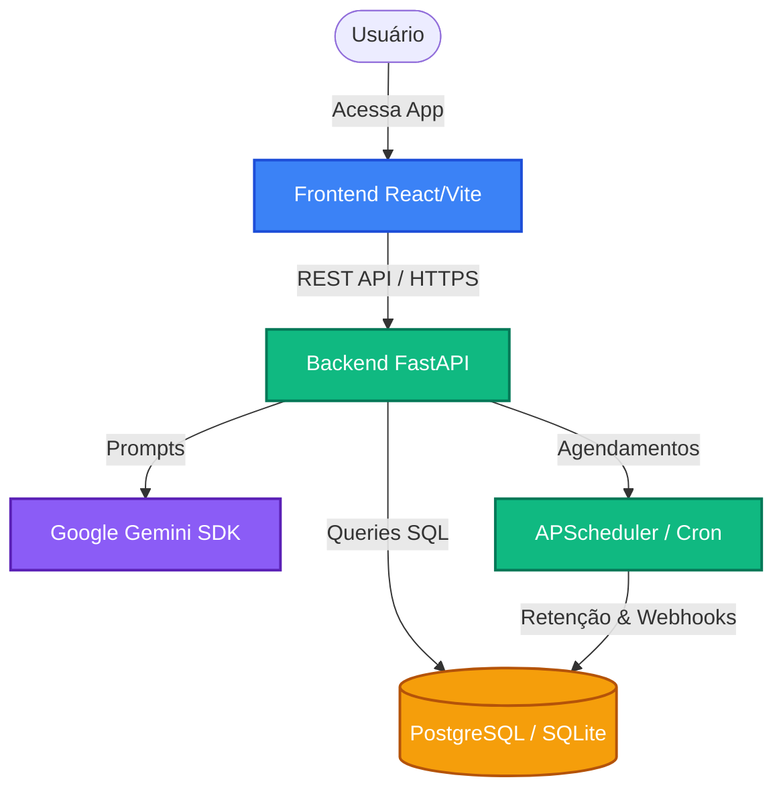
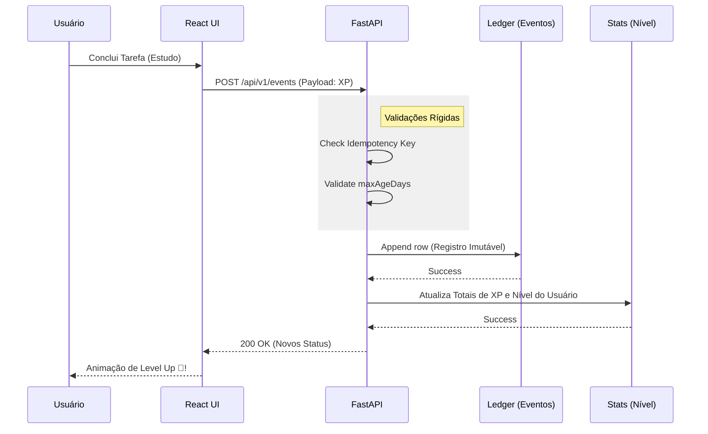
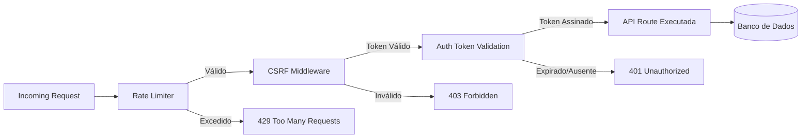

# 📊 Dashboard de Arquitetura e Fluxo

Bem-vindo ao Dashboard estrutural do sistema. Abaixo você encontra os gráficos diagramados que explicam como os dados fluem na plataforma KKSH.

## 1. Topologia do Sistema (Visão Geral)

 

## 2. Fluxo do Sistema Gamificado (Ledger & XP)

 

## 3. Arquitetura de Proteção e Segurança (Defesa em Profundidade)

 

*Você pode copiar e colar o conteúdo raw (Markdown) dessse arquivo diretamente nas páginas da Wiki do repositório no GitHub para renderizar esses gráficos dinamicamente!*
